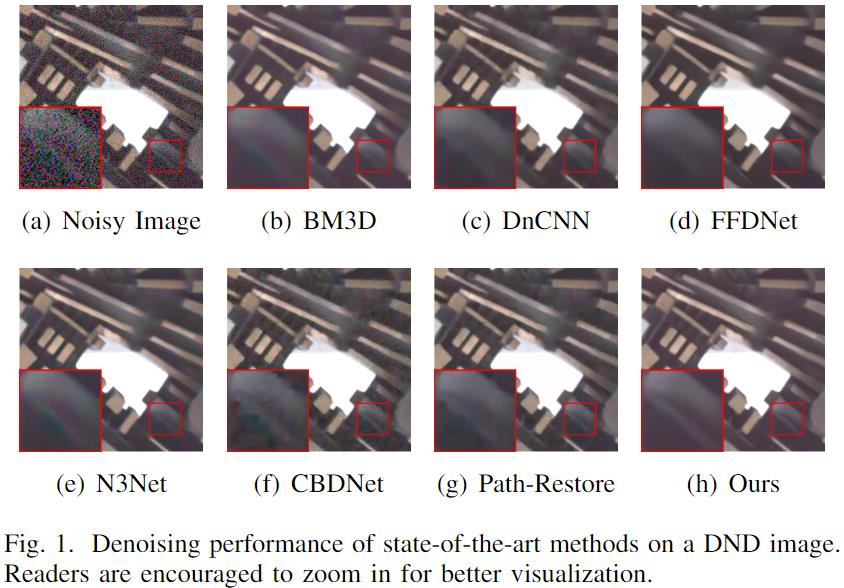

# Pyramid Real Image Denoising Network
This is the code for the paper "Pyramid Real Image Denoising Network". ( VCIP 2019 oral )

Paper : [Pyramid Real Image Denoising Network](https://arxiv.org/abs/1908.00273?context=cs.CV)

Training dataset : [SIDD Medium Dataset](https://www.eecs.yorku.ca/~kamel/sidd/dataset.php)

Validation dataset : [SIDD Validation data](https://www.eecs.yorku.ca/~kamel/sidd/benchmark.php)

Testing dataset : [SIDD Benchmark](https://www.eecs.yorku.ca/~kamel/sidd/benchmark.php),    [DND](https://noise.visinf.tu-darmstadt.de/),   [NC12](http://demo.ipol.im/demo/125/archive/)

The trained model for raw_rgb : [Google Driver](https://drive.google.com/drive/folders/1hXEYHpwF0wjKHl5loR58HklSSNMxtg7v?usp=sharing) 

## 1. Abstract
While deep Convolutional Neural Networks (CNNs) have  shown  extraordinary  capability  of  modelling  specific  noiseand  denoising,  they  still  perform  poorly  on  real-world  noisyimages.  The  main  reason  is  that  the  real-world  noise  is  moresophisticated and diverse. To tackle the issue of blind denoising,in this paper, we propose a novel pyramid real image denoisingnetwork (PRIDNet), which contains three stages. First, the noiseestimation stage uses channel attention mechanism to recalibratethe  channel  importance  of  input  noise.  Second,  at  the  multi-scale  denoising  stage,  pyramid  pooling  is  utilized  to  extractmulti-scale  features.  Third,  the  stage  of  feature  fusion  adopts  akernel selecting operation to adaptively fuse multi-scale features.Experiments  on  two  datasets  of  real  noisy  photographs  demon-strate  that  our  approach  can  achieve  competitive  performancein  comparison  with  state-of-the-art  denoisers  in  terms  of  bothquantitative  measure  and  visual  perception  quality.

## 2. Network Structure

## 3. Experiments

### 3.1 Quantitative performance of our model on DND compared with other published techniques, and sorted by sRGB PSNR.

### 3.2 Denoising performance of state-of-the-art methods on a DND image.

### 3.3 Denoising performance of state-of-the-art methods on a NC12 image.

